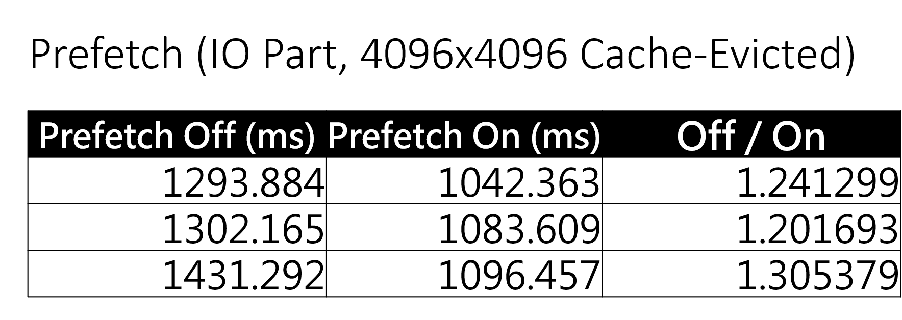
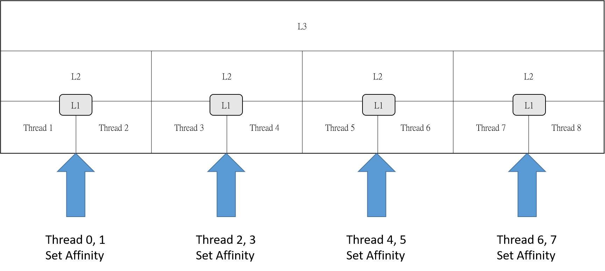

# OptimizedSquareMatrixMultiplication
This code was a part of course homework for optimizing competition in 2018.
The code is based on AVX2 instruction with Cache Prefetching.

## Environment
Windows 10
Visual Studio 2015
i7-4790R with 128MB eDRAM (Turbo-boosting **Off**)

## Input
Small (16x16)
Middle (1024x1024) 
Large (4096x4096)

All elements including results would be ranged in **int32**

## Optimization

### AVX2
For Haswell architecture, the reciprocal throughput of PNULLD is two.

Utilizing AVX2, we can process **8** add/mul in one instruction.

### Cache Optimization

Reduce Cache Miss is always a big issue for improving performance.

In this code, there are 4 concerns about the cache problems.

#### Continuous Memory Section
Use **calloc** to allocate a continuous memory section.

I saw somebody used an array of vertor<> to store data, which is not the right choice.

#### Prefetch
Inside the CPU, there is hardware that automatically loads extra memory in cache while reading.

Prefetching might impair the performance when the memory has already loaded by hardware (at least one cycle for running this instruction).

This program seldom prefetches data. It only prefetches data, which the CPU will not prefetch automatically.

Besides, prefetch can help mark a cache line as **evicting**, so the cache utilization rate will be further improved.

I have measured the performance difference between Prefetch-on and Prefetch-off. 

Compared to Prefetch-off, Prefetch-on has more than a 20% advantage.

#### Prevent False Sharing
Wikipedia: ``
When a system participant attempts to periodically access data that will never be altered by another party, but those data share a cache block with data that are altered, the caching protocol may force the first participant to reload the whole unit despite a lack of logical necessity.
``

To prevent False Sharing, always keep a CACHE_LINE_SIZE(64B) memory between each data.

Using thread-local variables can also reduce problems.

However, sometimes it is hard to prevent False Sharing, such as writing results to a specific memory section.

This program writes results back when the thread has already done its job.

Even if False Sharing occurs, these threads have been suspended because they have done their jobs.

#### SetThreadAffinityMask for Hyper-Threading (Simultaneous MultiThreading)
Operating-System achieves multi-tasks by time-slicing approaches for each thread.

Content Switches have costs, so we usually will not create thousands of threads to compute.

Besides, when a thread is assigned to another logical process that it had not been, it must fetch data from LLC(Last Level Cache) to its L1 cache.

To prevent this problem, we can set the threads' affinity to specify what logical process it will be assigned to.

When it comes to Hyper-Threading, one physical process has two logical processes, which share one L1/L2/LLC cache.

It will reduce some costs if we bind two threads to one physical process.
Besides, it will help reduce the waiting time caused by processes occupied by others.

``
However, when the input size is too small, the performance decreases because threads need to wait for their logical processors to become free.
``

### SetPriority (Process Level)
According to [MSDN](https://msdn.microsoft.com/en-us/library/windows/desktop/ms685100(v=vs.85).aspx) , using REALTIME_PRIORITY_CLASS flag will interrupt system threads that manage IO, including mouse input and keyboard input.

### SetThreadPriority (Thread Level)
Using SetThreadPriority(hThread, THREAD_PRIORITY_TIME_CRITICAL) can mark this program as time critical.

## Performance Comparison

Running on i7-4770R (Clock fixed at 3.2G)

LPDDR3 1600MHz 8G*2

(Without I/O Time. Both of them created 8 threads to compute.)
| Name | 16 | 1024 | 4096|
| ----------- | ----------- | ----------- | ----------- |
| Normal Strassen (ms) | 0.005 | 272.89 | 12409.236|
| AVX2 (ms)  | 0.424 | 29.09 | 3882.783|
|Comparsion (x faster)|NA|9.38x| 3.1959x|

Although Strassen algorithm has a lower time complexity, optimized AVX2-based matrix multiplication has shown an advantage if the input is **not very large**.

So, it shows the importance of optimization.

By the way, compared to other classmates who also implemented an AVX2 matrix multiplication program without other optimization (but running on i7-4790K), this program still showed more than **2x** faster performance.

## Further Improvement
This code was written in 2018, and this code might be outdated since new technologies.

I address some points below.

### Modules/Chiplets Design
For Ryzen Processors, it has one(Zen3) or two(Zen1, Zen2) CCX in one die.

When a thread accesses data not belong to its CCX, the latency is significantly slower than accessing the LLC cache.

Besides, Zen 1 Threadripper, Zen 2, and its successors have multiple chips in one CPU.

Cross-die accessing requires higher communication time, so we need to compromise it.

### CLWB(Cache Line Write Back) and WBNOINVD (Write Back and Do Not Invalidate Cache)
Zen2 architecture has supported these two instructions.

These instructions help the utilization rate of caches.

However, I am not sure that these instructions can be called in user-mode.

Perhaps these two can only be called in kernel-mode.